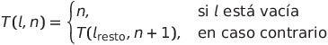

# 📌 Documentación de `definirManiobra` - Taller 3

⚡ **Clase `Maniobra`**

## 📖 Descripción

La clase `Maniobra` implementa un sistema de planificación de movimientos para transformar un tren inicial en un tren objetivo. El método principal `definirManiobra` encuentra una secuencia mínima de movimientos, utilizando una **búsqueda por anchura (BFS)** en un espacio de estados, modelando el problema de forma totalmente funcional.

Este problema es representativo de planificación en entornos discretos, típicos de la inteligencia artificial clásica.

## 🧩 Tipos Utilizados

```scala
type Estado = (List[Char], List[Char], List[Char])
type Movimiento = Uno | Dos
type Trayectoria = List[Movimiento]
```

* `Estado`: tupla con tres listas, que representan la pila principal (la vía), y dos pilas auxiliares (pistas secundarias).
* `Movimiento`: un paso atómico que representa mover uno o más vagones entre las pilas.
* `Trayectoria`: secuencia ordenada de movimientos que lleva del estado inicial al estado objetivo.

## 🔧 Implementación Principal

```scala
def definirManiobra(trenInicial: List[Char], trenObjetivo: List[Char]): List[Movimiento] = {
  val estadoFinal: Estado = (trenObjetivo, Nil, Nil)
  val estadoInicial: Estado = (trenInicial, Nil, Nil)

  @tailrec
  def bfs(fringe: List[(Estado, Trayectoria)], visitados: Set[Estado]): Trayectoria = fringe match {
    case Nil => Nil // No se encontró solución
    case (estadoActual, trayectoria) :: resto =>
      if (estadoActual == estadoFinal) trayectoria
      else {
        val nuevos = sucesores(estadoActual)
          .filterNot(e => visitados.contains(e))
          .map(e => (e, trayectoria :+ movimientoAplicado(estadoActual, e)))

        bfs(resto ++ nuevos, visitados ++ nuevos.map(_._1))
      }
  }

  bfs(List((estadoInicial, Nil)), Set(estadoInicial))
}
```

## 📊 Estrategia de Resolución

* Se usa **búsqueda en anchura** para garantizar una solución mínima (en número de movimientos).
* Se genera una lista de posibles movimientos (`Uno(n)` y `Dos(n)` con valores entre -3 y 3).
* Para cada estado se aplican estos movimientos, evitando repetir estados ya visitados.
* La primera vez que se alcanza el estado objetivo se devuelve el camino recorrido.

## ✅ Pruebas Unitarias (TestManiobra.scala)

Incluyen:

* Casos simples de invertir una lista.
* Transformaciones arbitrarias con 6+ elementos.
* Casos con trenes largos y desorden aleatorio.

### Ejemplo:

```scala
test("Transformar tren inicial en tren objetivo - caso simple") {
  val trenInicial = List('a', 'b', 'c', 'd')
  val trenObjetivo = List('d', 'c', 'b', 'a')

  val movimientos = maniobra.definirManiobra(trenInicial, trenObjetivo)
  val estados = maniobra.aplicarMovimientos((trenInicial, Nil, Nil), movimientos)

  val resultadoFinal = estados.last._1
  assert(resultadoFinal == trenObjetivo)
}
```

## 💡 Recursos y Técnicas Funcionales Usadas

* Recursión optimizada con `@tailrec`
* Inmutabilidad de estructuras de datos
* Uso de funciones puras para aplicar movimientos
* Generación de espacio de estados usando listas y filtrado
* Modelado algebraico con `case class` y `trait`

## 🌋 Definición Matemática

Un estado es una tupla $(v_1, v_2, v_3)$ representando las tres pistas.

Una maniobra es una sucesión finita de funciones $m_1, m_2, ..., m_n$ tales que:

$m_i : Estado_i \rightarrow Estado_{i+1}$

La función `definirManiobra` busca una secuencia $\{m_i\}$ tal que:

$aplicarMovimientos(Estado_0, \{m_i\}) = Estado_{objetivo}$

Con $n$ mínimo (solución óptima).

## 📌 Formula Latex

<p>
  
</p>

1. Partimos de una lista \( l \) y un contador \( n \), representando el estado y el número de movimientos hasta el momento.

2. Si la lista \( l \) está vacía, el número de movimientos es \( n \), y no se realizan más cambios.

   $$
   T(l, n) = n \quad \text{si } l \text{ está vacía}
   $$

3. Si la lista \( l \) no está vacía, se aplica un movimiento (de manera recursiva) al resto de la lista \( l_{\text{resto}} \), incrementando el contador \( n \).

   $$
   T(l, n) = T(l_{\text{resto}}, n+1) \quad \text{si } l \text{ no está vacía}
   $$

4. La fórmula representa el proceso recursivo de aplicar los movimientos hasta que la lista \( l \) quede vacía.

## 🚀 Aplicaciones y Extensiones

* Problemas de logística con pila y cola
* Reordenamiento en puertos, hangares, almacenes

##  📖 Conclusión

La implementación de definirManiobra demuestra cómo aplicar técnicas de programación 
funcional para resolver problemas de búsqueda de caminos mediante movimientos definidos 
sobre un estado compuesto. Al utilizar estructuras inmutables, recursión con optimización 
de cola y un espacio de búsqueda limitado por movimientos predefinidos, la solución 
encuentra una secuencia válida (aunque no necesariamente óptima) para transformar un tren 
inicial en uno objetivo.Este enfoque refleja principios clave de la programación funcional
y puede extenderse a otros problemas de transformación de estados, demostrando la versatilidad
de Scala en este paradigma.