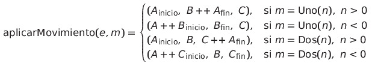

# 📘 Documentación - `aplicarMovimiento`
Este módulo forma parte del sistema de simulación de maniobras de trenes. Se enfoca en el funcionamiento detallado de la función `aplicarMovimiento`, encargada de modelar el desplazamiento de vagones entre tres pilas representadas como listas inmutables.
## 🧾 Descripción General
La función `aplicarMovimiento` toma como entrada un estado del tren, representado como una tupla `(A, B, C)` donde cada componente es una pila (lista de vagones), y un `Movimiento`, que puede ser de tipo `Uno(n)` o `Dos(n)`.
### Firma de la función
```scala
def aplicarMovimiento(e: Estado, m: Movimiento): Estado
```
- **`Estado`**: Tupla de tres listas `(A, B, C)` representando la pila principal, la pila auxiliar y la pila secundaria, respectivamente.
- **`Movimiento`**: Acción a aplicar sobre el estado. Puede ser:
    - `Uno(n)`: Mover `n` vagones entre `A` y `B`.
    - `Dos(n)`: Mover `n` vagones entre `A` y `C`.
## ⚙️ Lógica de Funcionamiento
La implementación está basada en patrones (`pattern matching`) sobre el tipo de movimiento:
```scala
def aplicarMovimiento(e: Estado, m: Movimiento): Estado = m match {
  case Uno(n) if n > 0 =>
    val (resto, mover) = e._1.splitAt(e._1.length - (n min e._1.length))
    (resto, mover ++ e._2, e._3)
  case Uno(n) if n < 0 =>
    val (mover, resto) = e._2.splitAt((-n) min e._2.length)
    (e._1 ++ mover, resto, e._3)
  case Dos(n) if n > 0 =>
    val (resto, mover) = e._1.splitAt(e._1.length - (n min e._1.length))
    (resto, e._2, mover ++ e._3)
  case Dos(n) if n < 0 =>
    val (mover, resto) = e._3.splitAt((-n) min e._3.length)
    (e._1 ++ mover, e._2, resto)
  case _ => e
}
```
### Comportamiento por casos
- `Uno(n > 0)`: Mueve `n` elementos desde el final de `A` al inicio de `B`.
- `Uno(n < 0)`: Mueve `n` elementos desde el inicio de `B` al final de `A`.
- `Dos(n > 0)`: Mueve `n` elementos desde el final de `A` al inicio de `C`.
- `Dos(n < 0)`: Mueve `n` elementos desde el inicio de `C` al final de `A`.
- En cualquier otro caso, retorna el estado original sin modificaciones.
### ✅ Pruebas Unitarias Clave
- **Secuencia combinada de movimientos**: Verifica que una serie de movimientos `Uno` y `Dos` aplicados consecutivamente devuelven el estado esperado.
- **Reversibilidad de operaciones**: Asegura que al invertir los movimientos el estado inicial puede recuperarse.
- **Transferencias completas**: Casos donde todos los elementos son trasladados entre pilas.
- **Carga masiva**: Ensayos con 100, 500 y 1000 movimientos para garantizar integridad y estabilidad del sistema.
### Ejemplo Destacado
```scala
val e1 = (List('a', 'b', 'c', 'd'), List(), List())
val e2 = obj.aplicarMovimiento(e1, Uno(1))
// Resultado esperado: (List('a','b','c'), List('d'), List())

val e3 = obj.aplicarMovimiento(e2, Dos(3))
// Resultado esperado: (List(), List('d'), List('a','b','c'))
```
## 📐 Representación de `aplicarMovimiento`
Dado un estado $e = (A, B, C)$ y un movimiento $m$, el resultado es:
$$
e' = \text{aplicarMovimiento}(e, m)
$$
Donde:
- $A$: pila principal.
- $B$: pila auxiliar.
- $C$: pila secundaria.
---
### 🔹 Movimiento Uno(n)
- **Si** $n > 0$: mueven los primeros $n$ elementos de $A$ a $B$.
- **Si** $n < 0$: mueven los primeros $|n|$ elementos de $B$ a $A$, en orden inverso.
$$
Uno(n) \Rightarrow
\begin{cases}
(A',\ B ++ A_1,\ C) & \text{si } n > 0 \\
(B_1 ++ A,\ B',\ C) & \text{si } n < 0 \\
\end{cases}
$$
---
### 🔹 Movimiento Dos(n)
- **Si** $n > 0$: mueven los primeros $n$ elementos de $A$ a $C$.
- **Si** $n < 0$: mueven los primeros $|n|$ elementos de $C$ a $A$, en orden inverso.
$$
Dos(n) \Rightarrow
\begin{cases}
(A',\ B,\ C ++ A_1) & \text{si } n > 0 \\
(C_1 ++ A,\ B,\ C') & \text{si } n < 0 \\
\end{cases}
$$
---
**Notas**:
- $A_1$: primeros elementos de $A$.
- $A'$: elementos restantes de $A$.
- Análogamente para $B_1$, $B'$, $C_1$, $C'$.
- $++$: concatenación de listas.
## 🖼️ Diagrama de la lógica de movimientos
<div align="center">
  
</div>

## ✅ Conclusión
`aplicarMovimiento` es el componente central que permite modelar con precisión el comportamiento dinámico del tren. Su implementación funcional y la cobertura de pruebas exhaustiva la convierten en una herramienta confiable y eficiente para la simulación paso a paso de maniobras.