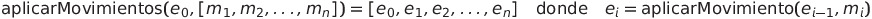

#  📘 Reporte - (Movimientos)

Este módulo implementa una simulación de maniobras de trenes usando listas inmutables para representar el estado de tres pilas: la principal (`A`), una auxiliar (`B`) y otra secundaria (`C`). Solo se cubre la parte correspondiente a **movimientos**.
##  🧾 Enfoque: `aplicarMovimientos`

La función `aplicarMovimientos` es el núcleo de esta parte del sistema. Su propósito es aplicar una secuencia de instrucciones (`Maniobra`) a un estado inicial de las pilas del tren, devolviendo una lista con todos los estados intermedios que se generan paso a paso.

###  📌 La función

```scala
def aplicarMovimientos(e: Estado, movs: Maniobra): List[Estado]
```

* `Estado`: Representado como una tupla `(A, B, C)`, donde cada componente es una lista de vagones.
* `Maniobra`: Una lista de `Movimiento`, que puede ser `Uno(n)` o `Dos(n)`.

###  📌 Lógica interna

Internamente, se usa una función recursiva con acumulador para ir aplicando cada movimiento de forma secuencial. Se parte del estado inicial y se agrega a la lista acumulada el resultado de cada nuevo movimiento aplicado.

```scala
@tailrec
def aux(movs: Maniobra, acc: List[Estado]): List[Estado] = ...
```

Esta estructura garantiza que se conserve el historial completo del proceso, algo útil tanto para depuración como para visualización paso a paso.

###  📌 Formula Latex
<p>
  
</p>

1. Partimos de un estado inicial $e_0$.

2. Se aplica cada movimiento $m_i$ en orden.

3. Cada estado siguiente $e_i$ es el resultado de aplicar el movimiento $m_i$ al estado anterior $e_{i-1}$, es decir:

   $$
   e_i = \text{aplicarMovimiento}(e_{i-1}, m_i)
   $$

4. Se retorna la lista completa de estados intermedios, incluyendo el estado inicial:
   $$
   [e_0, e_1, e_2, \dots, e_n]
   $$
###  📌 Ejemplos de prueba
Algunas pruebas que validan el comportamiento correcto de esta función:
* **Secuencias combinadas:** Se asegura que los movimientos se encadenan correctamente y terminan con los vagones en las pilas esperadas.
* **Reversibilidad:** Se prueba que una secuencia larga de movimientos que simulan ciclos no genera pérdidas, y se puede volver al estado original.
* **Transformaciones controladas:** Validan que `aplicarMovimientos` puede reconstruir un orden invertido del tren a través de pasos lógicos y sin errores de estado.
## ✅ Conclusión
La función `aplicarMovimientos` es fundamental para verificar y rastrear el efecto acumulado de una serie de maniobras sobre un tren. Gracias a su diseño claro y recursivo, permite mantener control y trazabilidad de cada cambio en el sistema.